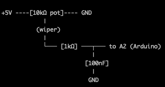

# Can-Roller

Arduino driven device to roll up to 12 drink cans in unison for filming purposes

## Hardware

- 1 x Arduino CNC shield v3 with DRV8825 motor drivers
- 1 x Elegoo Uno R3
- 2 x HANPOSE 17HS4401-S 40mm Nema 17 Stepper Motor 42 Motor 42BYGH 1.7A 40N.cm 4-lead Motor
- 2 x GT2 2mm Pitch 6mm Width Closed Loop Synchronous Timing Belt 750 teeth 1500mm
- 2 x Machifit GT2 Timing Pulley 20 Teeth Synchronous Wheel Inner Diameter 5mm for 6mm Width Belt
- 4 x GT2 Idler Pulley 20 Teeth

## Control Input Features

| Feature | Ver | IO Pin | Description | Wiring |
|---------|----|--------|-------------|--------|
| START button | v1 | A0 | If idle: start run (planned 5s total). If running: cancel and ramp down smoothly from current speed, then stop | Buttons wired to GND, use INPUT_PULLUP (pressed = LOW) |
| REVERSE button | v1 | A1 | Toggles travel direction | Buttons wired to GND, use INPUT_PULLUP (pressed = LOW) |
| SPEED pot | v1 | A2 | Sets cruise step rate | 5V → end, A2 → wiper, GND → other end |
| RUNTIME pot | v2 | A3 | Sets run time | 5V → end, A3 → wiper, GND → other end |

## File Versions
| File - Version | Description |
|--------------|--------------------|
| can-roller-v1.ini | UNO + CNC Shield V3 + (2x) DRV8825 - START button (A0): &nbsp;&nbsp;&nbsp;&nbsp;* if idle: start run (according to set runtime) &nbsp;&nbsp;&nbsp;&nbsp;* if running: cancel and ramp down smoothly from CURRENT speed, then stop - REVERSE button (A1): toggles direction for NEXT run only - SPEED pot (A2): read once at start, sets cruise steps/sec (no mid-run updates) - Soft start/stop: 0.5s ramp up / 0.5s ramp down - DDS/phase-accumulator stepping (smooth, low jitter) Buttons wired to GND, using INPUT_PULLUP (pressed = LOW) |
| can-roller-v2.ini | **New Feature: Variable Runtime Control** - Added **RUNTIME pot** on analog pin **A3** for adjustable run duration (3-10 seconds) - Runtime is read and latched when START button is pressed - Replaces fixed 8-second duration from Version 1  **Hardware Change:** - Add potentiometer to A3 (wired same as other pots: 5V → end, A3 → wiper, GND → other end)  **Control Summary:** **A0**: START button - starts run or cancels mid-run **A1**: REVERSE button - toggles direction for next run **A2**: SPEED pot - read once at start, sets cruise (1000-9500 steps/sec) **A3**: RUNTIME pot - sets run duration (3-10 seconds) ⭐ NEW  All other features unchanged: 0.5s soft start/stop, DDS stepping, smooth cancellation. |
| can-roller-v3.ini | **New Feature: Cruise speed variation during runtime** 1. Multi-Layer Noise Filtering: Implemented moving average filter (5 samples) - smooths out electrical noise spikes Rate limiting (2000 steps/sec² max change) - prevents sudden jerks from pot movements Periodic sampling (every 50ms) - reduces ADC noise impact.  2. How It Works: Raw Pot → Moving Average → Rate Limiter → Motor Speed   (noisy)    (smoothed)      (gradual)     (smooth)  **Control Summary:** **A0**: START button - starts run or cancels mid-run **A1**: REVERSE button - toggles direction for next run **A2**: SPEED pot - sets cruise (1000-9500 steps/sec) **A3**: RUNTIME pot - sets run duration (3-10 seconds)  All other features unchanged: 0.5s soft start/stop, DDS stepping, smooth cancellation. |

## Power & step config

12V: 1/8 micro-stepping
Set jumpers MS1 ON, MS2 ON, MS3 OFF → 1600 steps/rev

	• DRV8825 @ 1/8 microstepping ⇒ 1600 steps/rev (200 × 8)
	• Can diameter ≈ 66 mm ⇒ circumference C ≈ 207.35 mm
	• GT2 pitch = 2 mm ⇒ belt travel per motor rev = 2 × teeth (mm)
	• Ideal no-slip rolling (and cans are constrained from translating)

Motor speed from step rate (independent of pulley teeth):
	• At 1000 steps/s: motor = 1000/1600 = 0.625 rps
	• At 9500 steps/s: motor = 9500/1600 = 5.9375 rps

Belt speed = motor_rps × (2×teeth)
Can speed (rev/s) = belt_speed / 207.35
 
A slave to X
	• Place a jumper on A → X

This electrically connects:
	• A_STEP → X_STEP
	• A_DIR  → X_DIR

So:
	• Both motors receive the same STEP and DIR signals
	• Arduino code only needs to drive X
	• A direction reversed owing to mounting

## DRV8825 Current Setting
### Configuration:
#### Stepper Motor: HANPOSE 17HS4401-S
• Rated Current: 1.7A per phase 
• Holding Torque: 40 N·cm (0.4 N·m) 
• Type: 4-lead bipolar 

#### DRV8825 Driver:
Vref measured (from pot centre arm to Gnd): 0.7V 
Current sense resistors: 0.1Ω (standard on most DRV8825 boards)

### Calculated Current Output:
Using the DRV8825 formula: 
Current Limit = Vref / (8 × Rs) 
Where: 
• Vref = 0.7V (your measurement) 
• Rs = 0.1Ω (sense resistor value) 

Current = 0.7V / (8 × 0.1Ω) = 0.875A

### Analysis:
✅ Safe Configuration
The motor is rated for 1.7A, and we're running it at 0.875A (≈51% of rated current). 
Pros: 
• Motors run cooler 
• Reduced risk of overheating 
• Longer motor life 
• Adequate torque for most applications 

Cons: 
• Not using full torque potential 
• May skip steps under heavy load 

### Current Setting Options:
#### Option 1: Keep Current Setting (Recommended for your application)
Vref = 0.7V → 0.875A

Good for belt-driven systems with moderate load 
Cooler operation 
Rolling cans shouldn't require full torque

#### Option 2: Increase to 70% rated current
Target: 1.19A 
Vref = Current × 8 × Rs 
Vref = 1.19 × 8 × 0.1 = 0.952V 
Adjust pot to 0.95V for more torque reserve 

#### Option 3: Maximum safe current (80% rated) 
Target: 1.36A 
Vref = 1.36 × 8 × 0.1 = 1.088V 
Adjust pot to ≈1.1V for maximum torque 

Warning: Motors will run hotter 
May need heatsinks or active cooling 

### Recommended Setting for this application:
Keep at 0.7V (0.875A) unless we experience: 
• Belt slipping under load 
• Motors skipping steps 
• Insufficient torque to move cans smoothly 

If you need more torque, increase to 0.85-0.95V (1.06-1.19A) and monitor motor temperature.

### How to Adjust (if needed):
Power off system 
Locate tiny potentiometer on DRV8825 
Connect multimeter: 
Black probe → GND 
Red probe → metal screwdriver touching pot wiper 

Power on (no motor movement needed) 
Turn pot slowly while monitoring voltage 
Clockwise = increase, Counter-clockwise = decrease 
Power off before removing multimeter 

### Temperature Check:
After running for 5-10 minutes, motors should be: 
• Warm to touch: Normal (40-50°C) 
• Hot but holdable (2+ seconds): Acceptable (50-70°C) 
• Too hot to hold: Too high (>70°C) - reduce current 

Your 0.7V setting should keep motors comfortably warm, not hot.

## Potentiometer Filter
Hardware fix for noisy analog potentiometer.

### Connection order:
1. Pot wiper → one leg of 1kΩ resistor 
2. Other leg of 1kΩ resistor → splits to: 
   • Arduino pin A2 / A3 
   • One leg of 100nF capacitor 
3. Other leg of 100nF capacitor → GND 

The junction point (where the resistor, Ax, and capacitor meet) is key - that's where the filtered signal sits.

We're actually using 1.5kΩ resistor which is fine. 

### Why This Works:
• The capacitor forms a low-pass filter that removes high-frequency electrical noise 
• Your code already averages 10 samples, so the capacitor won't make the response too sluggish 
• Ceramic caps are non-polarized, so orientation doesn't matter 

### What's the Point of the 1kΩ Resistor?
• Creates a Proper Low-Pass Filter: 
• The resistor + capacitor form an RC low-pass filter with a specific cutoff frequency: 
• Cutoff frequency = 1 / (2π × R × C) 

### With 1kΩ and 100nF: ~1.6 kHz cutoff
This blocks noise above 1.6 kHz while passing your slow pot movements

### Why It's Better Than Capacitor Alone:
Prevents ADC Input Loading: The capacitor directly on the ADC input can cause issues because the Arduino's ADC has internal resistance (~10kΩ). The 1kΩ resistor isolates this. 
More Predictable Filtering: Without the resistor, the filter behavior depends on the pot position (pot resistance varies as you turn it). The 1kΩ makes filtering consistent. 
Reduces High-Frequency Noise: The resistor limits current spikes when the cap charges/discharges, providing cleaner filtering. 

## Pulley Specs

20T pulley
Belt per rev: 40 mm

	• 1000 steps/s
		○ Belt speed: 0.625 × 40 = 25.0 mm/s
		○ Can speed: 25.0 / 207.35 = 0.1206 rps = 7.23 RPM
		○ Time per turn: 8.29 s/rev
	• 9500 steps/s
		○ Belt speed: 5.9375 × 40 = 237.5 mm/s
		○ Can speed: 237.5 / 207.35 = 1.1454 rps = 68.73 RPM
		○ Time per turn: 0.873 s/rev

24T pulley
Belt per rev: 48 mm

	• 1000 steps/s
		○ Belt speed: 0.625 × 48 = 30.0 mm/s
		○ Can speed: 30.0 / 207.35 = 0.1447 rps = 8.68 RPM
		○ Time per turn: 6.91 s/rev
	• 9500 steps/s
		○ Belt speed: 5.9375 × 48 = 285.0 mm/s
		○ Can speed: 285.0 / 207.35 = 1.3745 rps = 82.47 RPM
		○ Time per turn: 0.728 s/rev

